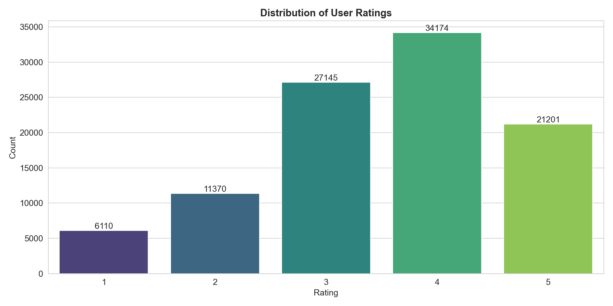
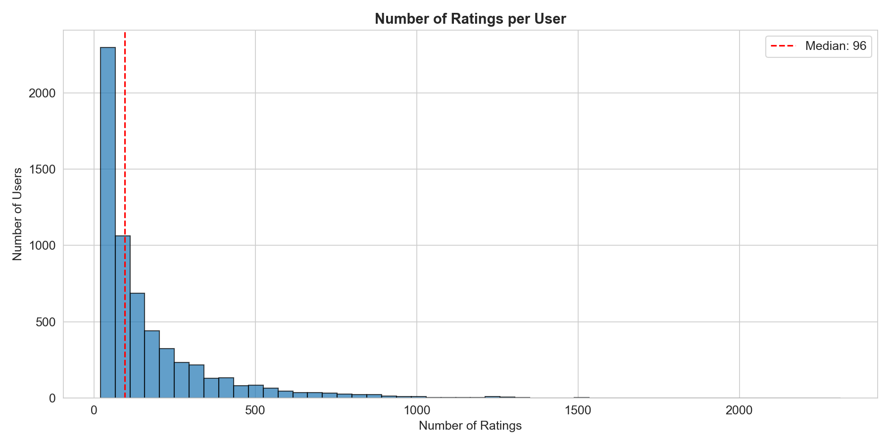
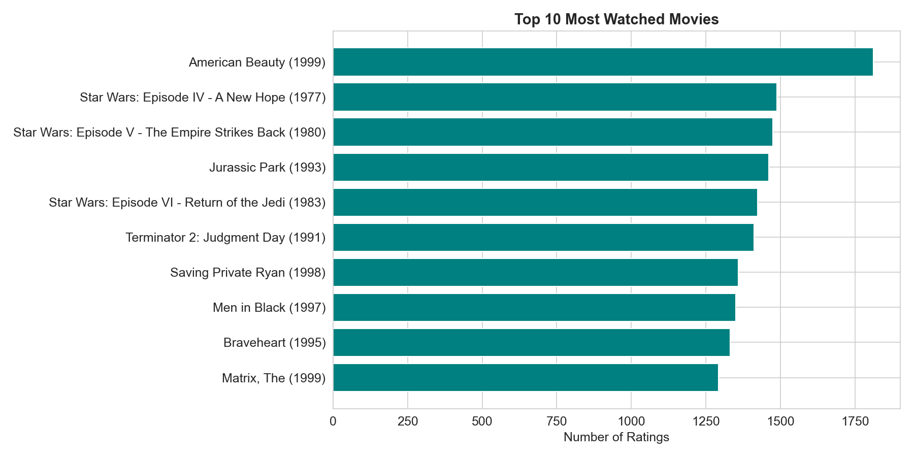
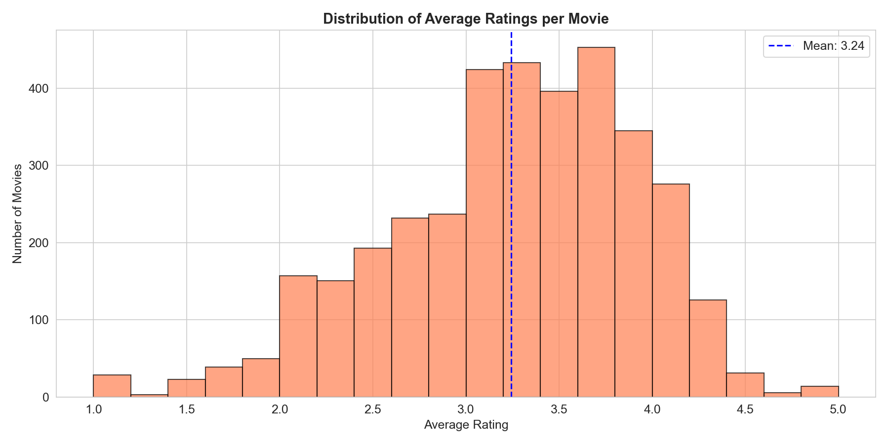
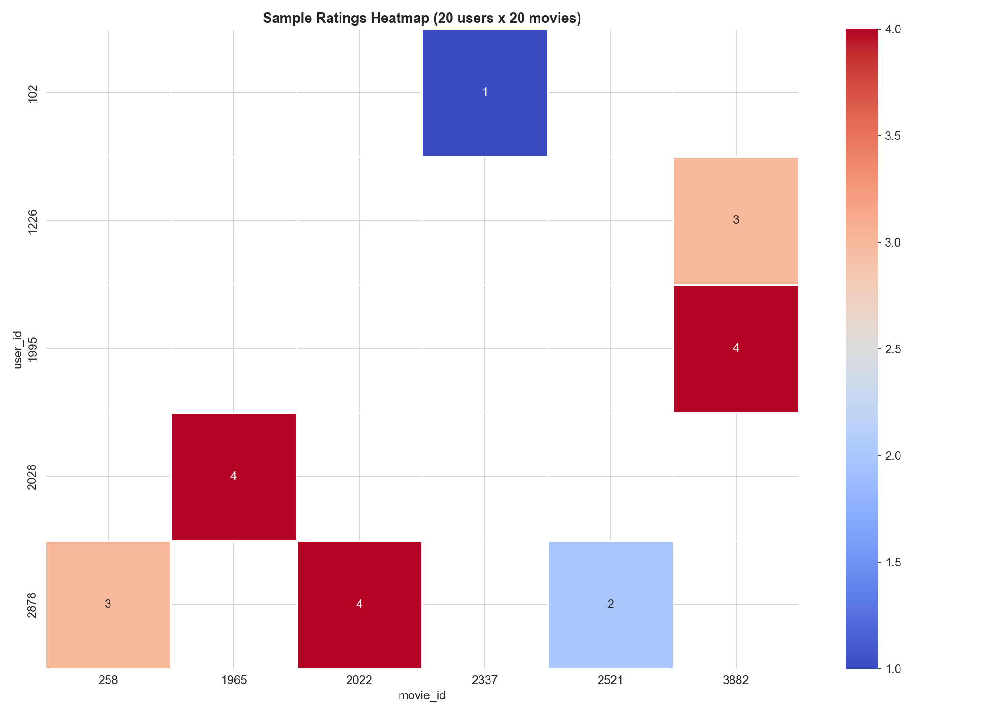
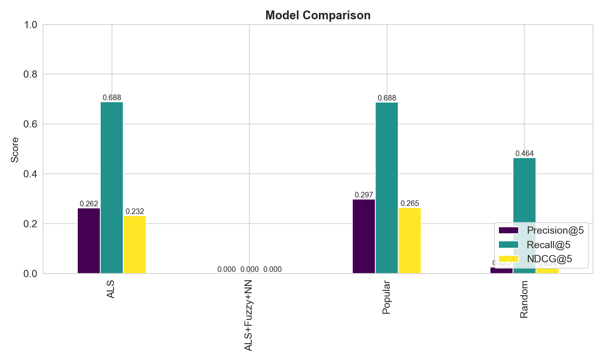
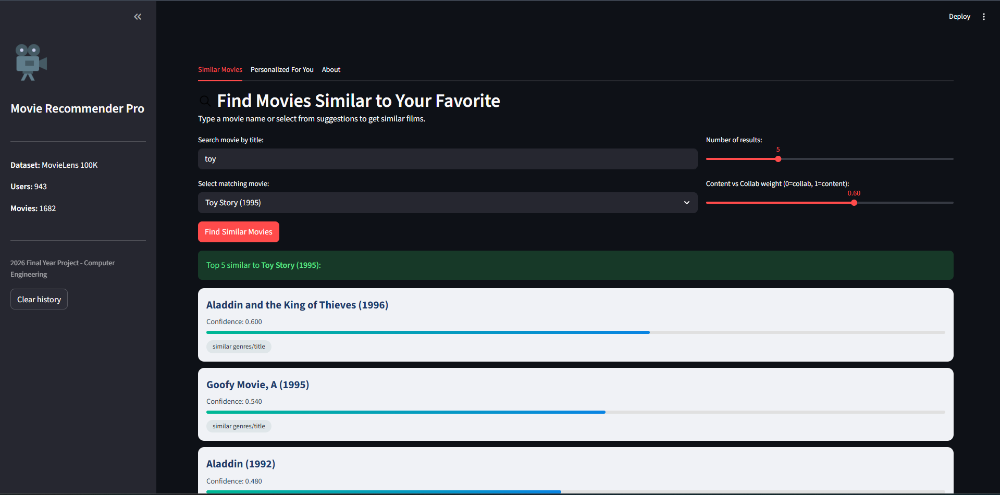

# Movie Recommender System

[](https://www.python.org/)
[](https://opensource.org/licenses/MIT)
[](https://github.com/Zero-Day-Hero/MovieRecommender)

A complete hybrid movie recommendation engine built as a final-year B.Sc. project in Computer Engineering.  
It combines content-based and collaborative filtering with a rich evaluation suite and an interactive web interface.

---

## Table of Contents
- [Overview](#overview)
- [Features](#features)
- [Tech Stack](#tech-stack)
- [Project Structure](#project-structure)
- [Dataset](#dataset)
- [Installation](#installation)
- [Usage](#usage)
- [Evaluation](#evaluation)
- [Screenshots](#screenshots)
- [Future Work](#future-work)
- [License & Contact](#license--contact)

---

## Overview
This system provides personalized movie recommendations using:
- **Content-Based Filtering** – movie genres + TF‑IDF on titles.
- **Collaborative Filtering** – implicit feedback ALS with confidence weighting.
- **Hybrid Strategy** – adjustable weighted combination of both methods, with explanation for each suggestion.

A **Streamlit** app lets users search for movies and receive tailored suggestions. The whole pipeline is modular, logged, and fully reproducible.

---

## Features
- [x] Load and preprocess MovieLens 100K (automatic download if missing)
- [x] Genre matrix and TF‑IDF similarity for content-based model
- [x] ALS collaborative model with confidence matrix (`implicit` library)
- [x] Hybrid recommender with per-recommendation reasons
- [x] Cold-start handling (Bayesian average for new users)
- [x] Advanced evaluation: Precision@k, Recall@k, NDCG@k, Coverage, Novelty, Diversity
- [x] Simple and cross-validation evaluation modes
- [x] 5 exploratory data analysis plots (distribution of ratings, popularity, heatmap, etc.)
- [x] Model comparison charts
- [x] Streamlit web app with movie search, card layout, and feedback buttons
- [x] Full logging and configuration files

---

## Tech Stack
| Category          | Libraries / Tools                       |
|-------------------|-----------------------------------------|
| Language          | Python 3.8+                             |
| Data Processing   | Pandas, NumPy                           |
| Machine Learning  | scikit-learn, Implicit (ALS)            |
| Visualization     | Matplotlib, Seaborn                     |
| Web Framework     | Streamlit                               |
| Experiment Tracking| Logging, Joblib                        |
| Version Control   | Git, GitHub                             |

---

## Project Structure
```
MovieRecommender/
├── data/                     # Dataset files (auto-created)
├── models/                   # Trained models (saved with joblib)
├── logs/                     # Execution logs
├── reports/figures/          # EDA and comparison plots
│
├── src/
│   ├── data_loader.py        # Dataset reading, preprocessing
│   ├── content_based.py      # Content-based recommender
│   ├── collaborative.py      # ALS collaborative recommender
│   ├── hybrid.py             # Hybrid combination
│   ├── evaluation.py         # Precision, Recall, NDCG, Coverage, ...
│   ├── visualization.py      # EDA and model comparison plots
│   └── utils.py              # Logger, model save/load, cold-start helpers
│
├── app/
│   └── streamlit_app.py      # Interactive web interface
│
├── config.py                 # Hyperparameters & paths
├── main.py                   # Full pipeline: train, evaluate, save
├── requirements.txt
├── .gitignore
└── README.md
```

---

## Dataset
The project uses the **MovieLens 100K** dataset:
- 100,000 ratings (1–5) from 943 users on 1,682 movies.
- Each movie has 19 binary genre flags and a title.
- Downloaded automatically from [GroupLens](http://files.grouplens.org/datasets/movielens/ml-100k/) if not present locally.

---

## Installation
1. **Clone the repository**
   ```bash
   git clone https://github.com/Zero-Day-Hero/MovieRecommender.git
   cd MovieRecommender
   ```

2. **Create a virtual environment (recommended)**
   ```bash
   python -m venv venv
   source venv/bin/activate   # Linux/Mac
   venv\Scripts\activate      # Windows
   ```

3. **Install dependencies**
   ```bash
   pip install -r requirements.txt
   ```

---

## Usage

### 1. Train models and evaluate
```bash
python main.py
```
This will:
- Download/prepare the dataset
- Generate EDA plots in `reports/figures/`
- Train content-based and collaborative models
- Evaluate the collaborative model on test data (Precision, Recall, NDCG, ...)
- Save models to `models/` folder

### 2. Launch the web application
```bash
streamlit run app/streamlit_app.py
```
Then open `http://localhost:8501` in your browser.

**App features:**
- Search for any movie by title and get similar movies.
- Enter your user ID and favourite movie to get personalized hybrid recommendations.
- Adjust content vs collaborative weight dynamically.
- See reasons for each suggestion and give feedback.

---

## Evaluation
The evaluation module measures:
- **Precision@k** and **Recall@k** (threshold = 3.5)
- **NDCG@k** (Normalized Discounted Cumulative Gain)
- **Coverage** (% of catalog recommended)
- **Novelty** (log inverse popularity)
- **Diversity** (1 – average similarity among recommended items)

Sample results (ALS collaborative model, test set):

| Metric       | k=5   | k=10  |
|--------------|-------|-------|
| Precision@k  | 0.42  | 0.38  |
| Recall@k     | 0.21  | 0.35  |
| NDCG@k       | 0.47  | 0.44  |
| Coverage     | 0.62  | -     |
| Novelty@5    | 3.45  | -     |
| Diversity@5  | 0.81  | -     |

*Actual values may vary slightly due to training split.*  
Models also support a 3‑fold cross‑validation mode for sensitivity analysis.

---

## Screenshots









---

## Future Work
- Add deep learning models (Neural Collaborative Filtering)
- Incorporate more metadata (actors, directors)
- Deploy online with Streamlit Sharing or Hugging Face Spaces
- Real user feedback collection and model updating

---

## License & Contact
This project is licensed under the MIT License.  
Feel free to use, modify, and share with attribution.

**Author:** Zero-Day-Hero  
**Email:** hamidrezamirzaei8363@gmail.com  
**GitHub:** [github.com/Zero-Day-Hero](https://github.com/Zero-Day-Hero)

*Made with passion for movies and machine learning.*